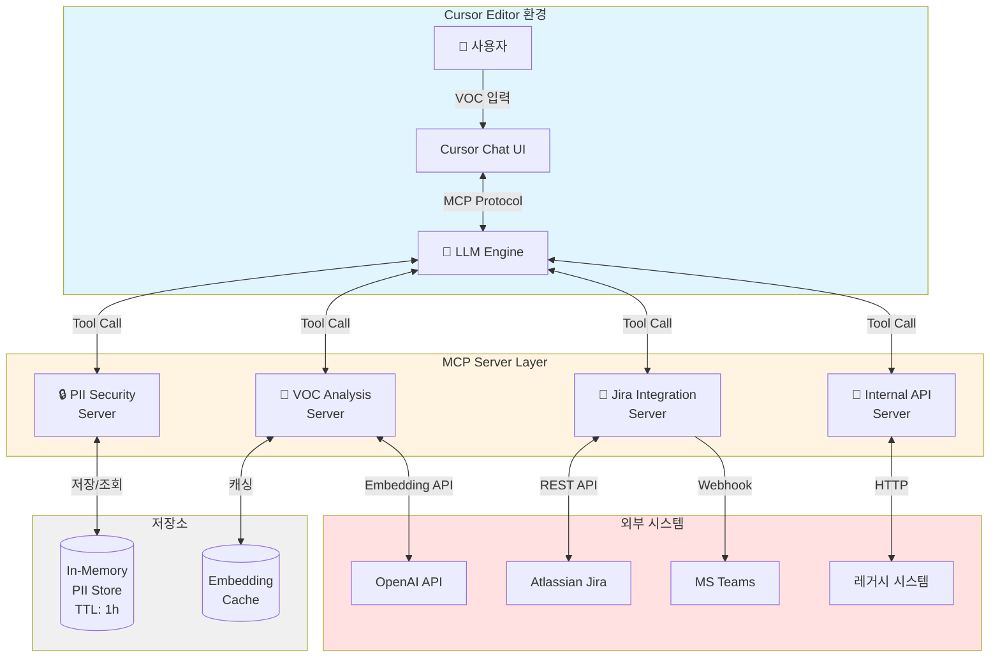
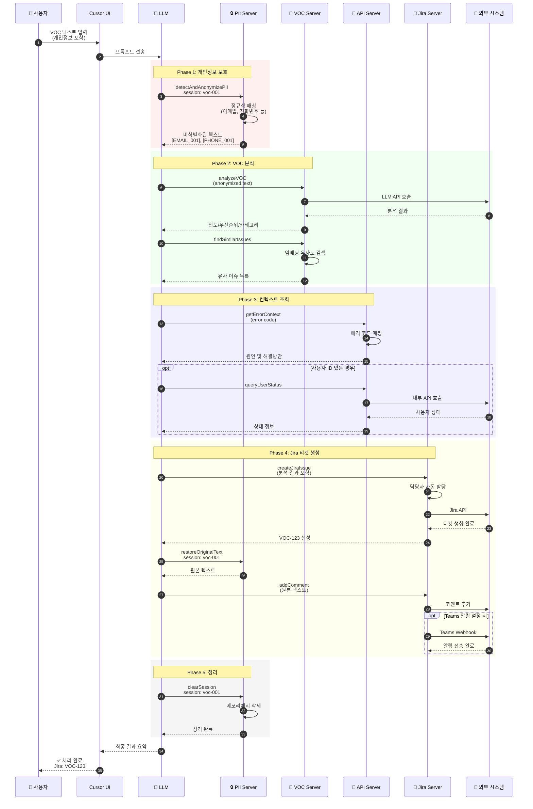

# VOC 처리 자동화 MCP 서버

[](https://github.com/your-username/voc-automation-mcp-server/releases)
[](https://opensource.org/licenses/MIT)
[](https://nodejs.org/)
[](https://github.com/your-username/voc-automation-mcp-server/actions)
[](CONTRIBUTING.md)

고객 VOC(Voice of Customer)를 접수부터 Jira 티켓 생성, 알림 발송까지 자동으로 처리하는 MCP(Model Context Protocol) 기반 엔터프라이즈 시스템입니다.

## 📋 목차

- [주요 기능](#주요-기능)
- [시스템 구성](#시스템-구성)
- [빠른 시작](#빠른-시작) ⭐ 5분이면 끝!
- [사용 예시](#사용-예시)
- [문서](#문서)
- [Nexus 배포](#nexus-배포)
- [지원](#지원)

## 🎯 주요 기능

### 개인정보 보호
- 📧 이메일, 📱 전화번호, 🆔 주민번호, 💳 카드번호 자동 감지
- 🔒 실시간 비식별화 처리 (LLM에 원문 전송 차단)
- ♻️ 필요시에만 원문 복원 (Jira 저장용)
- ⏱️ 1시간 후 자동 삭제 (메모리 누수 방지)

### 지능형 분석 (Cursor LLM 활용)
- 🤖 Cursor 연동 LLM으로 VOC 의도 분류 (버그/기능요청/문의/불만/피드백)
- 📊 우선순위 자동 판단 (Critical → Low)
- 🏷️ 카테고리 자동 추출 (인증/결제/성능/UI 등)
- 😊 감정 분석 (긍정/중립/부정)
- 🔍 임베딩 기반 중복 이슈 검색
- ✨ **별도 LLM API 키 불필요** - Cursor의 LLM 사용

### 자동 티켓팅
- 🎫 Jira 이슈 자동 생성
- 👥 카테고리 기반 담당자 자동 할당
- 💬 분석 결과 자동 코멘트 추가
- 📢 MS Teams 알림 발송 (Adaptive Card)

### 에러 컨텍스트
- 🔧 8가지 표준 에러 코드 해석 (AUTH_001, BILL_001 등)
- 📝 원인 및 해결 방안 자동 제공
- 📜 사용자 에러 로그 조회
- 🏥 시스템 헬스체크

## 🏗️ 시스템 구성

본 시스템은 4개의 독립적인 MCP 서버로 구성됩니다:

| 서버 | 역할 | 주요 Tool |
|------|------|-----------|
| **PII Security** | 개인정보 보호 | `detectAndAnonymizePII`, `restoreOriginalText` |
| **VOC Analysis** | 프롬프트 생성 & 파싱 | `generateVOCAnalysisPrompt`, `parseVOCAnalysis` |
| **Jira Integration** | 티켓 자동화 | `createJiraIssue`, `addComment` |
| **Internal API** | 레거시 연동 | `queryUserStatus`, `getErrorContext` |

### 시스템 아키텍처



### 데이터 흐름 (VOC 처리 워크플로우)



### 주요 특징

**🔒 보안 우선 설계**
- 개인정보는 LLM에 절대 전송되지 않음
- In-Memory 저장으로 디스크 유출 방지
- 1시간 후 자동 삭제

**⚡ 병렬 처리**
- VOC 분석과 유사 이슈 검색 동시 실행
- API 호출 재시도 로직 내장
- 평균 처리 시간: 15-30초

**🔄 확장 가능**
- 독립적인 MCP 서버 구조
- 새로운 서버 추가 용이
- 각 서버 개별 배포 가능

## 🚀 빠른 시작

### 1단계: 패키지 설치

#### NPM 레지스트리 설정 (사내 Nexus 사용 시)

```bash
# .npmrc 파일 생성 또는 수정
echo "registry=https://your-nexus-url/repository/npm-group/" >> .npmrc
```

#### 패키지 다운로드 및 설치

```bash
# Nexus에서 다운로드
npm install @your-company/voc-automation-mcp-server

# 또는 Git에서 직접 클론
git clone https://github.com/your-company/voc-automation-mcp-server.git
cd voc-automation-mcp-server

# 의존성 설치
npm install

# 빌드
npm run build
```

### 2단계: 환경변수 설정

```bash
# .env 파일 생성
cp .env.example .env
```

**최소 필수 설정:**

```bash
# Jira 연동 (필수)
JIRA_BASE_URL=https://your-company.atlassian.net
JIRA_EMAIL=your-email@company.com
JIRA_API_TOKEN=your-jira-api-token

# LLM API (선택 - 임베딩 검색용)
# VOC 분석은 Cursor의 LLM을 사용하므로 API 키 불필요!
# 유사 이슈 검색 기능만 사용하려면 OpenAI 키 필요
OPENAI_API_KEY=sk-...  # 선택사항

# 내부 API (선택)
INTERNAL_API_BASE_URL=https://internal-api.company.com
INTERNAL_API_KEY=your-api-key
```

**선택 설정:**

```bash
# MS Teams 알림
TEAMS_WEBHOOK_URL=https://outlook.office.com/webhook/...

# 자동 담당자 할당
ASSIGNEE_AUTH=jira-account-id-for-auth-team
ASSIGNEE_BILLING=jira-account-id-for-billing-team
ASSIGNEE_PERF=jira-account-id-for-perf-team
ASSIGNEE_UI=jira-account-id-for-ui-team
```

> 💡 **API 키 발급 방법은 [`docs/DEPLOYMENT.md`](docs/DEPLOYMENT.md)를 참고하세요.**

### 3단계: Cursor 설정

#### 방법 A: 자동 설정 (권장)

```bash
# 설치 스크립트 실행 (향후 추가 예정)
npm run setup:cursor
```

#### 방법 B: 수동 설정

`~/.cursor/mcp.json` 파일을 생성하거나 수정:

```json
{
  "mcpServers": {
    "pii-security": {
      "command": "node",
      "args": ["<설치경로>/servers/pii-security-server/dist/index.js"]
    },
    "voc-analysis": {
      "command": "node",
      "args": ["<설치경로>/servers/voc-analysis-server/dist/index.js"]
    },
    "jira-integration": {
      "command": "node",
      "args": ["<설치경로>/servers/jira-integration-server/dist/index.js"]
    },
    "internal-api": {
      "command": "node",
      "args": ["<설치경로>/servers/internal-api-server/dist/index.js"]
    }
  }
}
```

> ⚠️ `<설치경로>`를 실제 설치 경로로 변경하세요.

### 4단계: Cursor 재시작 및 테스트

Cursor를 완전히 재시작한 후 채팅창에서 테스트:

```
사용 가능한 MCP 도구 목록을 보여줘
```

**성공 시**: 16개 이상의 도구가 표시됩니다 ✅

## 💬 사용 예시

### 기본 워크플로우

Cursor 채팅창에 다음과 같이 입력하세요:

```
다음 VOC를 처리해줘:

"로그인이 안돼요. 이메일은 hong.gildong@example.com이고 
전화번호는 010-1234-5678입니다. AUTH_001 에러가 계속 나와요."

처리 순서:
1. 개인정보 비식별화 (세션: voc-20260107-001)
2. VOC 분석 프롬프트 생성
3. 프롬프트로 VOC 분석 (Cursor의 LLM 사용)
4. 분석 결과 파싱
5. 유사 이슈 검색
6. AUTH_001 에러 컨텍스트 조회
7. Jira 티켓 생성 (프로젝트: VOC, Teams 알림 전송)
8. 원문 복원해서 Jira 코멘트 추가
9. 세션 정리
```

### 결과 예시

```json
{
  "처리완료": true,
  "세션ID": "voc-20260107-001",
  "개인정보감지": {
    "이메일": 1,
    "전화번호": 1
  },
  "분석결과": {
    "의도": "불만",
    "우선순위": "High",
    "카테고리": ["인증", "로그인"],
    "신뢰도": 0.92
  },
  "유사이슈": 0,
  "Jira티켓": {
    "키": "VOC-123",
    "URL": "https://your-company.atlassian.net/browse/VOC-123",
    "담당자": "인증팀"
  },
  "Teams알림": "발송완료"
}
```

## 📚 문서

상세한 사용 방법은 다음 문서를 참고하세요:

| 문서 | 내용 | 대상 |
|------|------|------|
| **[⚡ 빠른 시작](docs/QUICKSTART.md)** | 5분 설치 가이드 | 모든 사용자 |
| **[📖 사용자 가이드](docs/USER_GUIDE.md)** | 실전 사용법, 예제, 트러블슈팅 | 일반 사용자 |
| **[🔧 API 명세서](docs/API.md)** | 모든 Tool의 입력/출력 스키마 | 개발자 |
| **[🚀 배포 가이드](docs/DEPLOYMENT.md)** | 설치, 설정, 운영 가이드 | 시스템 관리자 |
| **[📦 Nexus 배포](docs/NEXUS_DEPLOYMENT.md)** | 사내 Nexus 배포 방법 | DevOps |
| **[🔒 보안 문서](docs/SECURITY.md)** | PII 보호, 취약점 대응 | 보안 담당자 |

## 📦 Nexus 배포

**DevOps 팀을 위한 가이드**

사내 Nexus에 패키지를 배포하여 직원들이 쉽게 설치할 수 있도록 하는 방법:

### 배포 준비

```bash
# 1. 패키지 정보 업데이트
vim package.json
# → name: "@your-company/voc-automation-mcp-server"
# → version: "1.0.0"
# → publishConfig.registry 설정

# 2. 빌드
npm run build

# 3. 배포 파일 확인
npm pack --dry-run
```

### Nexus에 배포

```bash
# Nexus 인증 설정
export NEXUS_AUTH_TOKEN=your-token

# 배포
npm publish
```

### 직원들의 설치 방법

```bash
# 1. Nexus 레지스트리 설정
npm config set @your-company:registry https://nexus.your-company.com/repository/npm-private/

# 2. 패키지 설치
npm install @your-company/voc-automation-mcp-server

# 3. Cursor 설정
npm run setup:cursor
```

**상세 가이드**: [`docs/NEXUS_DEPLOYMENT.md`](docs/NEXUS_DEPLOYMENT.md) 참고

## 🔧 프로젝트 구조

```
voc-automation-mcp-server/
├── servers/
│   ├── pii-security-server/        # 개인정보 보호
│   ├── voc-analysis-server/        # LLM 분석
│   ├── jira-integration-server/    # Jira 연동
│   └── internal-api-server/        # 내부 API 연동
├── shared/                          # 공통 유틸리티
├── docs/                            # 문서
│   ├── USER_GUIDE.md               # 사용자 가이드 ⭐
│   ├── API.md                      # API 명세서
│   ├── DEPLOYMENT.md               # 배포 가이드
│   └── SECURITY.md                 # 보안 문서
└── examples/                        # 예제
    ├── sample-voc.json             # 샘플 VOC 데이터
    └── cursor-prompts.md           # 프롬프트 예제
```

## 🔐 보안

- ✅ 개인정보는 절대 로그에 기록되지 않음
- ✅ 메모리에만 임시 저장 (1시간 후 자동 삭제)
- ✅ API 키는 환경변수로 안전하게 관리
- ✅ LLM에 민감 정보 전송 차단
- ✅ 모든 외부 API 통신은 HTTPS 암호화

## 🐛 문제 해결

### 서버가 시작되지 않아요
```bash
# 로그 확인
node servers/pii-security-server/dist/index.js

# 환경변수 확인
cat .env | grep JIRA
```

### Cursor에서 도구가 보이지 않아요
1. Cursor 완전 재시작
2. `~/.cursor/mcp.json` 경로 확인
3. 빌드 완료 여부 확인: `ls servers/*/dist/index.js`

### API 에러가 발생해요
- Jira: API 토큰이 유효한지 확인
- OpenAI: 사용량 제한 확인
- 네트워크: 프록시 설정 확인

> 더 많은 문제 해결 방법은 [`docs/USER_GUIDE.md`](docs/USER_GUIDE.md)의 "트러블슈팅" 섹션을 참고하세요.

## 🤝 기여하기

이 프로젝트는 오픈소스입니다! 기여를 환영합니다.

- **버그 리포트**: [GitHub Issues](https://github.com/your-username/voc-automation-mcp-server/issues)
- **기능 제안**: [Feature Request](https://github.com/your-username/voc-automation-mcp-server/issues/new?template=feature_request.md)
- **Pull Request**: [기여 가이드](CONTRIBUTING.md) 참고
- **토론**: [GitHub Discussions](https://github.com/your-username/voc-automation-mcp-server/discussions)

## 📞 지원

- **문의**: it-support@your-company.com
- **긴급**: Slack #voc-automation 채널
- **GitHub**: [이슈 등록](https://github.com/your-username/voc-automation-mcp-server/issues)

## 📄 라이선스

MIT License - 사내 사용 목적으로 자유롭게 사용 가능합니다.

---

**Version**: 1.0.0  
**Last Updated**: 2026-01-07  
**Maintained by**: VOC Automation Team

